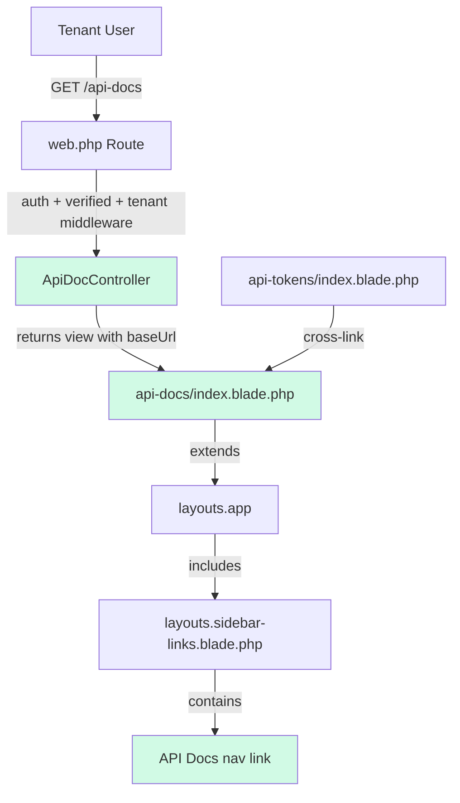

# Design Document: API Documentation Page

## Overview

This feature adds an in-dashboard API Documentation page to the Konektivitas (goblast) application. The page provides authenticated tenant users with a comprehensive reference for the REST API, covering authentication, all three endpoints (send-message, send-bulk, message-status), error handling, rate limiting, and code examples in PHP, JavaScript, and cURL.

The implementation follows the existing application patterns exactly: a single-action controller, a Blade view extending `layouts.app`, a route registered in the authenticated tenant middleware group, and a sidebar navigation entry. No new models, migrations, services, or dependencies are required — this is a read-only documentation page rendered from a Blade template with dynamic base URL resolution.

### Key Design Decisions

1. **Single Blade view (no database)**: Documentation content lives entirely in a Blade template. There is no need for a database-backed CMS since the API surface is small and stable. Content updates are deployed with code.
2. **Invokable controller**: Follows the pattern used by `AdminDashboardController` — a single `__invoke` method that returns the view. The controller passes only the dynamic base URL to the view.
3. **No feature middleware gating**: The documentation page is accessible to all authenticated tenant users regardless of plan. This is intentional — users should be able to read API docs even before upgrading to a plan that includes API access.
4. **Indonesian language (Bahasa)**: The UI text follows the existing application convention where navigation labels and user-facing text are in Indonesian.

## Architecture



The request flow is straightforward:

1. User clicks "API Docs" in the sidebar or the cross-link on the API Tokens page.
2. The request hits `GET /api-docs`, passing through `auth`, `verified`, and `tenant` middleware (same group as all other dashboard routes).
3. `ApiDocController@__invoke` computes the dynamic base URL from `config('app.url')` and returns the `api-docs.index` view.
4. The Blade view renders the full documentation within the standard dashboard layout.

## Components and Interfaces

### 1. ApiDocController

**File**: `app/Http/Controllers/ApiDocController.php`

An invokable controller with a single `__invoke` method. No constructor dependencies are needed.

```php
class ApiDocController extends Controller
{
    public function __invoke(): View
    {
        $baseUrl = rtrim(config('app.url'), '/') . '/api/v1';

        return view('api-docs.index', [
            'baseUrl' => $baseUrl,
        ]);
    }
}
```

**Rationale**: An invokable controller is the simplest pattern for a single-page read-only route. It matches the `AdminDashboardController` pattern already used in the codebase.

### 2. Route Registration

**File**: `routes/web.php`

A single `GET` route registered inside the existing `auth + verified + tenant` middleware group, placed directly after the API token routes:

```php
// API Documentation route
Route::get('api-docs', ApiDocController::class)->name('api-docs.index');
```

**Rationale**: Placing it in the same middleware group as `api-tokens` ensures consistent auth behavior. No `feature:api` middleware is applied — documentation should be accessible to all plans.

### 3. Sidebar Navigation Entry

**File**: `resources/views/layouts/sidebar-links.blade.php`

A new entry added to the `$navigation` array immediately after the "API Tokens" entry:

```php
[
    'name' => 'API Docs',
    'route' => 'api-docs.index',
    'icon' => '<path stroke-linecap="round" stroke-linejoin="round" d="M12 6.042A8.967 8.967 0 006 3.75c-1.052 0-2.062.18-3 .512v14.25A8.987 8.987 0 016 18c2.305 0 4.408.867 6 2.292m0-14.25a8.966 8.966 0 016-2.292c1.052 0 2.062.18 3 .512v14.25A8.987 8.987 0 0018 18a8.967 8.967 0 00-6 2.292m0-14.25v14.25" />',
    'active' => request()->routeIs('api-docs.*'),
],
```

**Rationale**: The icon is the Heroicons `book-open` outline (24x24), consistent with the existing icon style. The active state uses `routeIs('api-docs.*')` following the same pattern as other sidebar items.

### 4. API Tokens Page Cross-Link

**File**: `resources/views/api-tokens/index.blade.php`

A link added to the header description area:

```html
<p class="mt-2 text-sm text-gray-700">
    Kelola token API untuk integrasi eksternal.
    <a href="{{ route('api-docs.index') }}" class="text-green-600 hover:text-green-700 font-medium">
        Lihat Dokumentasi API →
    </a>
</p>
```

### 5. Documentation Blade View

**File**: `resources/views/api-docs/index.blade.php`

A single Blade view extending `layouts.app` with `@section('content')`. The view is structured into these sections:

1. **Header** — Page title, API version badge, dynamic base URL display
2. **Table of Contents** — Anchor links to each major section
3. **Authentication** — Bearer token explanation, header format, link to API Tokens page, security notice
4. **Endpoints**:
   - POST /api/v1/send-message — parameters table, sample request/response, validation rules
   - POST /api/v1/send-bulk — parameters table, sample request/response, recipient limits
   - GET /api/v1/message-status/{jobId} — path parameter, sample response, status values table
5. **Error Handling** — HTTP status codes table, sample error responses, common error scenarios
6. **Rate Limiting** — Rate limit info, response headers, 429 sample response
7. **Code Examples** — PHP (Guzzle), JavaScript (Fetch), cURL examples for send-message and message-status

The view uses Tailwind CSS utility classes matching the existing dashboard design: `bg-white` cards with `ring-1 ring-gray-900/5`, `rounded-lg`, green accent colors (`text-green-600`, `bg-green-50`), and `prose`-like typography using Tailwind utilities directly.

Code blocks use `<pre><code>` elements styled with `bg-gray-900 text-gray-100 rounded-lg p-4 overflow-x-auto text-sm` for a dark code theme consistent with developer documentation conventions.

## Data Models

No new database models, migrations, or schema changes are required. This feature renders static documentation content from a Blade template. The only dynamic data is the base URL derived from `config('app.url')`.

## Error Handling

Error handling for this feature is minimal since it's a read-only page:

| Scenario | Behavior | HTTP Code |
|---|---|---|
| Unauthenticated access | Redirect to login page | 302 |
| Unverified email | Redirect to email verification | 302 |
| No tenant association | Abort with 403 (handled by TenantMiddleware) | 403 |
| Route not found | Standard Laravel 404 | 404 |

No custom error handling is needed in the controller — the middleware stack handles all access control.

## Testing Strategy

### PBT Applicability Assessment

Property-based testing is **not applicable** for this feature. The entire feature consists of:
- A controller that returns a static view with a single computed string (base URL)
- A Blade template with static documentation content
- Sidebar navigation array modification
- A cross-link in an existing view

There are no pure functions with varying inputs, no data transformations, no parsers or serializers, and no business logic that would benefit from randomized input testing. All acceptance criteria map to specific example-based assertions (e.g., "page contains this text", "link points to this route", "middleware redirects unauthenticated users").

### Test Approach: Example-Based Feature Tests

All tests will be PHPUnit feature tests using Laravel's HTTP testing utilities.

**Test File**: `tests/Feature/ApiDocPageTest.php`

| Test | Validates | Approach |
|---|---|---|
| `testAuthenticatedUserCanAccessApiDocsPage` | Req 1.1, 1.3 | GET /api-docs as authenticated tenant user → assert 200, assert view is `api-docs.index` |
| `testUnauthenticatedUserIsRedirectedToLogin` | Req 1.2, 1.4 | GET /api-docs without auth → assert redirect to login |
| `testPageDisplaysBaseUrlFromConfig` | Req 10.1, 10.2, 10.3 | Assert response contains `config('app.url') . '/api/v1'` |
| `testPageDisplaysTableOfContents` | Req 11.1 | Assert response contains anchor links for each major section |
| `testPageDisplaysAuthenticationSection` | Req 4.1, 4.2, 4.3, 4.4 | Assert response contains Bearer token format, link to api-tokens, security notice |
| `testPageDisplaysSendMessageEndpoint` | Req 5.1, 5.2, 5.3, 5.4, 5.5 | Assert response contains POST /api/v1/send-message, parameter names, sample payloads, validation rules |
| `testPageDisplaysSendBulkEndpoint` | Req 6.1, 6.2, 6.3, 6.4, 6.5 | Assert response contains POST /api/v1/send-bulk, parameter names, recipient limits |
| `testPageDisplaysMessageStatusEndpoint` | Req 7.1, 7.2, 7.3, 7.4 | Assert response contains GET /api/v1/message-status, status values table |
| `testPageDisplaysErrorHandlingSection` | Req 8.1, 8.2, 8.3 | Assert response contains HTTP status codes table, error response examples |
| `testPageDisplaysCodeExamples` | Req 9.1, 9.3, 9.4 | Assert response contains PHP, JavaScript, and cURL code examples |
| `testPageDisplaysRateLimitingSection` | Req 12.1, 12.2, 12.3 | Assert response contains rate limit info, headers, 429 example |
| `testSidebarContainsApiDocsLink` | Req 2.1, 2.2 | Assert response contains "API Docs" link with correct route |
| `testApiTokensPageContainsDocsLink` | Req 3.1, 3.2, 3.3 | GET /api-tokens → assert response contains link to api-docs route with descriptive text |
