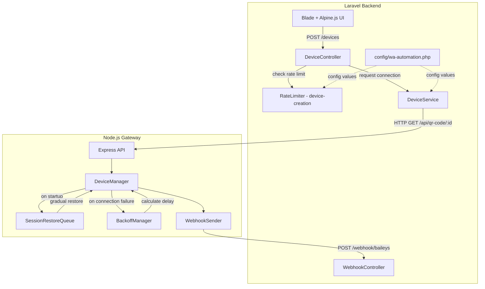
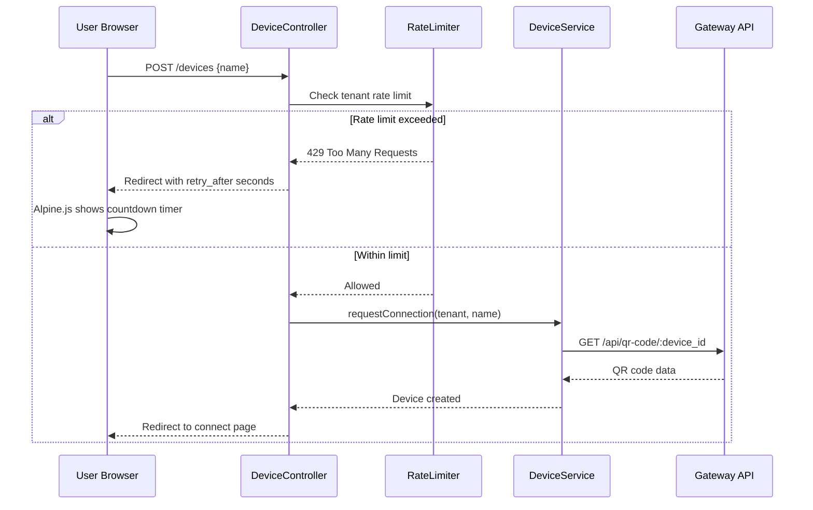
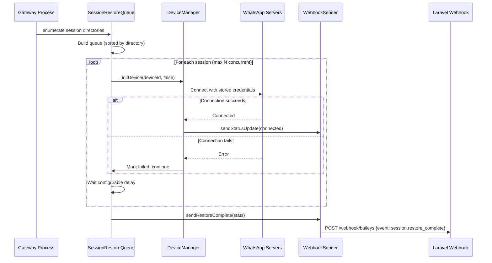
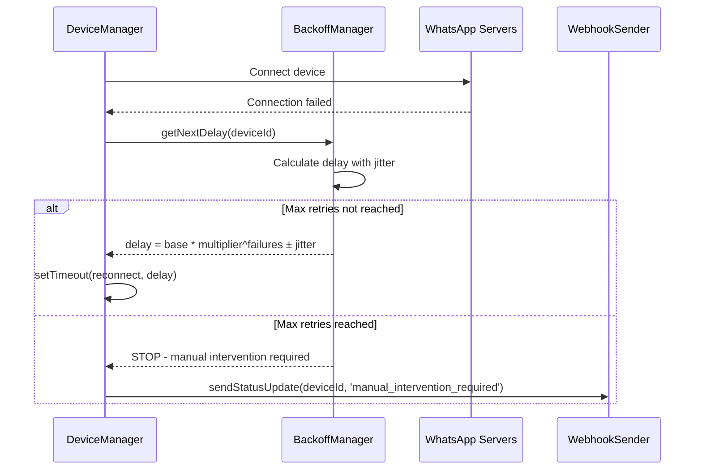

# Design Document: Gateway Rate Limiting & Protection

## Overview

This feature adds multi-layered protection to prevent WhatsApp account blocking and IP throttling across both the Laravel backend and Node.js gateway. The system addresses four key problems:

1. **Connection storms** — Gateway restarts restore all sessions simultaneously, overwhelming WhatsApp servers
2. **Rapid retry loops** — Failed connections retry with a fixed 3-second delay, causing IP throttling
3. **Unthrottled device creation** — Users can spam the "Add Device" button without rate limiting
4. **No user feedback** — Rate-limited users receive no explanation or countdown

The solution introduces rate limiting at the Laravel layer (device creation throttling per tenant), graceful session restoration with queuing at the gateway layer, exponential backoff with jitter for connection retries, and real-time UI feedback using Alpine.js.

### Design Decisions

1. **Laravel's built-in `RateLimiter` facade** for device creation throttling — leverages the existing cache infrastructure and provides a well-tested, framework-native approach. Keyed by `tenant_id` to prevent circumvention via multiple user accounts.

2. **Gateway-side queue for session restoration** — The gateway already manages sessions via the filesystem. Adding an in-memory queue with configurable concurrency and delay keeps the logic co-located with the connection management code.

3. **File-based backoff state persistence** — Backoff state is stored in a JSON file alongside session directories. This survives gateway restarts without requiring a database dependency in the Node.js service.

4. **Alpine.js countdown timer** — The frontend already uses Alpine.js. A lightweight Alpine component handles the countdown display and automatic button re-enabling without requiring a full page refresh.

## Architecture

### High-Level Component Interaction



### Request Flow: Device Creation with Rate Limiting



### Request Flow: Gateway Startup with Graceful Restore



### Request Flow: Exponential Backoff on Connection Failure



## Components and Interfaces

### Laravel Components

#### 1. Rate Limiter Definition (AppServiceProvider)

Register a named rate limiter `device-creation` in the service provider boot method using Laravel's `RateLimiter` facade. The limiter is keyed by `tenant_id` and reads configuration from `config/wa-automation.php`.

```php
// In AppServiceProvider::boot()
RateLimiter::for('device-creation', function (Request $request) {
    $tenant = $request->user()?->tenant;
    if (!$tenant) {
        return Limit::perMinute(1)->by($request->ip());
    }

    $maxAttempts = config('wa-automation.gateway_protection.device_creation.max_attempts', 3);
    $windowSeconds = config('wa-automation.gateway_protection.device_creation.window_seconds', 300);

    return Limit::perMinutes(
        (int) ceil($windowSeconds / 60),
        $maxAttempts
    )->by('tenant:' . $tenant->id)
     ->response(function (Request $request, array $headers) {
         $retryAfter = $headers['Retry-After'] ?? 60;
         return redirect()->route('devices.index')
             ->with('rate_limited', true)
             ->with('retry_after', (int) $retryAfter);
     });
});
```

#### 2. DeviceController Changes

Apply the `throttle:device-creation` middleware to the `store` method. The `create` route also checks rate limit status to show the countdown UI proactively.

```php
// New method to check rate limit status for AJAX
public function rateLimitStatus(): JsonResponse
{
    $tenant = Auth::user()->tenant;
    $key = 'tenant:' . $tenant->id;
    $limiterKey = 'device-creation';

    $attempts = RateLimiter::attempts($key);
    $maxAttempts = config('wa-automation.gateway_protection.device_creation.max_attempts', 3);
    $availableIn = RateLimiter::availableIn($key);

    return response()->json([
        'is_limited' => RateLimiter::tooManyAttempts($key, $maxAttempts),
        'remaining_attempts' => max(0, $maxAttempts - $attempts),
        'retry_after' => $availableIn,
    ]);
}
```

#### 3. Configuration Extension (config/wa-automation.php)

New `gateway_protection` key added to the existing config file:

```php
'gateway_protection' => [
    'device_creation' => [
        'max_attempts' => (int) env('WA_GATEWAY_DEVICE_CREATION_MAX_ATTEMPTS', 3),
        'window_seconds' => (int) env('WA_GATEWAY_DEVICE_CREATION_WINDOW_SECONDS', 300),
    ],
    'session_restore' => [
        'delay_between_sessions_ms' => (int) env('WA_GATEWAY_SESSION_RESTORE_DELAY_MS', 5000),
        'max_concurrent_restorations' => (int) env('WA_GATEWAY_SESSION_RESTORE_MAX_CONCURRENT', 3),
    ],
    'backoff' => [
        'initial_delay_ms' => (int) env('WA_GATEWAY_BACKOFF_INITIAL_DELAY_MS', 5000),
        'max_delay_ms' => (int) env('WA_GATEWAY_BACKOFF_MAX_DELAY_MS', 300000),
        'multiplier' => (float) env('WA_GATEWAY_BACKOFF_MULTIPLIER', 2),
        'jitter_factor' => (float) env('WA_GATEWAY_BACKOFF_JITTER_FACTOR', 0.3),
        'max_retries' => (int) env('WA_GATEWAY_BACKOFF_MAX_RETRIES', 10),
    ],
],
```

### Node.js Gateway Components

#### 4. BackoffManager (`gateway/src/backoffManager.js`)

Manages per-device retry state with exponential backoff and jitter. Persists state to a JSON file.

```javascript
class BackoffManager {
    constructor(options = {}) {
        this.initialDelay = options.initialDelay || 5000;
        this.maxDelay = options.maxDelay || 300000;
        this.multiplier = options.multiplier || 2;
        this.jitterFactor = options.jitterFactor || 0.3;
        this.maxRetries = options.maxRetries || 10;
        this.statePath = options.statePath || './sessions/.backoff_state.json';
        this.devices = new Map(); // deviceId -> { failures, lastFailure, nextRetry }
    }

    // Core methods
    recordFailure(deviceId): { delay, attempt, shouldRetry }
    recordSuccess(deviceId): void
    getNextDelay(deviceId): number
    shouldRetry(deviceId): boolean
    getState(deviceId): BackoffState | null
    getAllInBackoff(): BackoffState[]
    persistState(): void
    loadState(): void
}
```

**Delay calculation**: `delay = min(initialDelay * multiplier^failures, maxDelay) * (1 ± random * jitterFactor)`

#### 5. SessionRestoreQueue (`gateway/src/sessionRestoreQueue.js`)

Manages gradual session restoration on gateway startup.

```javascript
class SessionRestoreQueue {
    constructor(deviceManager, options = {}) {
        this.deviceManager = deviceManager;
        this.delayBetweenSessions = options.delayBetweenSessions || 5000;
        this.maxConcurrent = options.maxConcurrent || 3;
        this.status = 'idle'; // idle | in_progress | completed
        this.stats = { total: 0, restored: 0, failed: 0, pending: 0 };
        this.queue = [];
        this.activeCount = 0;
    }

    // Core methods
    async enqueueAll(sessionDirs): void
    async processQueue(): void
    async restoreSession(deviceId): { success, error? }
    prioritizeDevice(deviceId): void  // Move to front of queue
    getProgress(): RestoreProgress
    isRestoring(): boolean
}
```

#### 6. DeviceManager Changes

- Replace `_restoreExistingSessions()` with `SessionRestoreQueue` usage
- Replace fixed 3-second reconnect delay with `BackoffManager`
- Add `prioritizeDevice()` for new QR requests during restoration

#### 7. Health Endpoint Enhancement

The existing `/health` endpoint is extended to include protection status:

```javascript
// GET /health response shape
{
    status: 'ok',
    uptime: number,
    timestamp: string,
    devices: number,
    protection: {
        session_restore: {
            status: 'idle' | 'in_progress' | 'completed',
            progress_percentage: number,
            total: number,
            restored: number,
            failed: number,
            pending: number
        },
        backoff: {
            devices_in_backoff: number,
            devices: [{ device_id, failures, next_retry_at }]
        },
        capacity: {
            active_connections: number,
            max_connections: number  // from env
        }
    }
}
```

### Frontend Components

#### 8. Alpine.js Rate Limit Countdown

An Alpine.js component on the devices index page that:
- Reads `retry_after` from the session flash data
- Displays a countdown timer on the "Add Device" button
- Disables the button with a grayed-out + clock icon appearance
- Stores expiry time in `sessionStorage` to persist across navigations
- Auto-enables the button when the countdown reaches zero

## Data Models

### Laravel Side

No new database tables are required. Rate limiting uses Laravel's cache store (the existing `cache` table). The rate limiter key format is:

| Key Pattern | Purpose | TTL |
|---|---|---|
| `device-creation:tenant:{tenant_id}` | Track device creation attempts per tenant | Configured window (default 300s) |

### Node.js Gateway Side

#### Backoff State (persisted to `.backoff_state.json`)

```json
{
    "device_id_1": {
        "failures": 3,
        "lastFailureAt": "2025-01-15T10:30:00.000Z",
        "nextRetryAt": "2025-01-15T10:30:40.000Z",
        "lastError": "Connection timeout",
        "manualInterventionRequired": false
    }
}
```

| Field | Type | Description |
|---|---|---|
| `failures` | `number` | Consecutive failure count (resets on success) |
| `lastFailureAt` | `string (ISO 8601)` | Timestamp of last failure |
| `nextRetryAt` | `string (ISO 8601)` | Calculated next retry time |
| `lastError` | `string` | Error message from last failure |
| `manualInterventionRequired` | `boolean` | `true` when max retries exceeded |

#### Session Restore Queue State (in-memory only)

```typescript
interface RestoreProgress {
    status: 'idle' | 'in_progress' | 'completed';
    total: number;
    restored: number;
    failed: number;
    pending: number;
    startedAt: string | null;
    completedAt: string | null;
}
```

### Webhook Payloads (Gateway → Laravel)

#### Session Restore Complete Event

```json
{
    "event": "session.restore_complete",
    "device_id": "system",
    "from": "system",
    "message": "Session restoration completed",
    "stats": {
        "total": 10,
        "restored": 8,
        "failed": 2
    },
    "timestamp": "2025-01-15T10:30:00.000Z"
}
```

#### Manual Intervention Required Event

```json
{
    "event": "device.manual_intervention",
    "device_id": "uuid-here",
    "from": "uuid-here",
    "message": "Device requires manual intervention after 10 failed connection attempts",
    "status": "manual_intervention_required",
    "failure_count": 10,
    "last_error": "Connection timeout",
    "timestamp": "2025-01-15T10:30:00.000Z"
}
```

### Configuration Validation

Both Laravel and Gateway validate configuration values on startup:

| Parameter | Valid Range | Default | Validation |
|---|---|---|---|
| `device_creation.max_attempts` | 1–20 | 3 | Integer, clamped to range |
| `device_creation.window_seconds` | 60–3600 | 300 | Integer, clamped to range |
| `session_restore.delay_between_sessions_ms` | 1000–30000 | 5000 | Integer, clamped to range |
| `session_restore.max_concurrent_restorations` | 1–10 | 3 | Integer, clamped to range |
| `backoff.initial_delay_ms` | 1000–60000 | 5000 | Integer, clamped to range |
| `backoff.max_delay_ms` | 60000–600000 | 300000 | Integer, clamped to range |
| `backoff.multiplier` | 1.5–4.0 | 2.0 | Float, clamped to range |
| `backoff.jitter_factor` | 0.0–0.5 | 0.3 | Float, clamped to range |
| `backoff.max_retries` | 1–50 | 10 | Integer, clamped to range |


## Correctness Properties

*A property is a characteristic or behavior that should hold true across all valid executions of a system — essentially, a formal statement about what the system should do. Properties serve as the bridge between human-readable specifications and machine-verifiable correctness guarantees.*

### Property 1: Concurrent restoration limit

*For any* number of sessions N in the restore queue and any configured `maxConcurrent` value M, at no point during queue processing shall the number of actively restoring sessions exceed M.

**Validates: Requirements 2.3**

### Property 2: Restoration fault tolerance

*For any* session restore queue containing sessions where some subset fails, all non-failing sessions in the queue shall still be processed to completion, and the final restored count plus failed count shall equal the total queue size.

**Validates: Requirements 2.5**

### Property 3: Exponential backoff delay within bounds

*For any* failure count F (0 ≤ F < maxRetries), the calculated retry delay shall fall within the range `[baseDelay * (1 - jitterFactor), min(initialDelay * multiplier^F, maxDelay) * (1 + jitterFactor)]` where `baseDelay = min(initialDelay * multiplier^F, maxDelay)`.

**Validates: Requirements 3.1, 3.7**

### Property 4: Success resets backoff state

*For any* device with F consecutive failures (F > 0), recording a successful connection shall reset the failure count to 0 and `shouldRetry` shall return true for subsequent failures.

**Validates: Requirements 3.3**

### Property 5: Max retries triggers manual intervention

*For any* configured `maxRetries` value and any device, after exactly `maxRetries` consecutive failures, `shouldRetry` shall return false and `manualInterventionRequired` shall be true.

**Validates: Requirements 3.4**

### Property 6: Backoff state serialization round-trip

*For any* valid backoff state (containing arbitrary device IDs, failure counts, timestamps, and error messages), persisting the state to disk and loading it back shall produce an equivalent state object.

**Validates: Requirements 3.6**

### Property 7: Invalid configuration fallback to defaults

*For any* configuration parameter and any value outside its valid range, the system shall use the defined default value and the resulting effective configuration shall match the default.

**Validates: Requirements 6.5**

## Error Handling

### Laravel Side

| Scenario | Handling | User Feedback |
|---|---|---|
| Rate limit exceeded | Return 429 via `RateLimiter` response callback | Redirect with flash: toast notification + countdown timer |
| Gateway unreachable during device creation | `GatewayException` caught in `DeviceController` | Redirect with error: "Gagal terhubung ke gateway" |
| Rate limiter cache unavailable | Laravel falls back gracefully (allows request) | No visible impact — logged as warning |
| Invalid config values | Clamped to valid range on read | Warning logged at startup |

### Gateway Side

| Scenario | Handling | Notification |
|---|---|---|
| Session restore failure (single) | Log error, increment `failed` counter, continue queue | Included in restore_complete webhook stats |
| All session restores fail | Complete queue, send webhook with 0 restored | `session.restore_complete` webhook with failure stats |
| Backoff state file corrupted | Log warning, start with empty state | Warning logged |
| Backoff state file write failure | Log error, continue with in-memory state | Error logged |
| Max retries exceeded | Stop retries, mark `manualInterventionRequired` | `device.manual_intervention` webhook to Laravel |
| Connection failure during restore | Handled by BackoffManager, not re-queued in restore | BackoffManager schedules retry independently |
| QR request during restoration | Prioritized via `prioritizeDevice()` | Normal QR response to Laravel |

### Webhook Error Handling

The `WebhookController` already validates signatures and payload structure. New webhook events (`session.restore_complete`, `device.manual_intervention`) follow the existing payload format with `event`, `device_id`, `from`, `message` fields, so they pass the existing `validatePayloadStructure` check. The `ProcessWebhookJob` will need handlers for the new event types.

## Testing Strategy

### PHP (Laravel) — PHPUnit

**Unit Tests:**
- `BackoffConfigValidationTest` — Verify config values are clamped to valid ranges (Property 7)
- `RateLimiterConfigTest` — Verify `gateway_protection` config structure and defaults

**Feature Tests:**
- `DeviceCreationRateLimitTest`
  - Test rate limit allows requests within threshold
  - Test rate limit blocks requests exceeding threshold (returns 429 with retry_after)
  - Test rate limit is keyed by tenant_id (two users, same tenant, shared limit)
  - Test rate limit resets after window expires (using `Carbon::setTestNow()`)
  - Test direct route access when rate limited returns redirect with error
  - Test rate limit status AJAX endpoint returns correct JSON
- `WebhookNewEventsTest`
  - Test `session.restore_complete` webhook is accepted and processed
  - Test `device.manual_intervention` webhook is accepted and processed

### JavaScript (Gateway) — Jest or Vitest

**Property-Based Tests (using fast-check):**

Each property test runs a minimum of 100 iterations.

- **Property 1 test**: Generate random queue sizes (1–50) and maxConcurrent values (1–10). Process the queue with a mock DeviceManager that tracks active count. Assert active count never exceeds maxConcurrent.
  - Tag: `Feature: gateway-rate-limiting, Property 1: Concurrent restoration limit`

- **Property 2 test**: Generate random queue sizes (1–30) with random failure positions. Process the queue. Assert restored + failed = total and all non-failing sessions were processed.
  - Tag: `Feature: gateway-rate-limiting, Property 2: Restoration fault tolerance`

- **Property 3 test**: Generate random failure counts (0–maxRetries-1), random config values within valid ranges. Calculate delay. Assert delay falls within the expected bounds.
  - Tag: `Feature: gateway-rate-limiting, Property 3: Exponential backoff delay within bounds`

- **Property 4 test**: Generate random failure counts (1–maxRetries-1). Record that many failures, then record success. Assert failures = 0 and shouldRetry = true.
  - Tag: `Feature: gateway-rate-limiting, Property 4: Success resets backoff state`

- **Property 5 test**: Generate random maxRetries values (1–50). Record exactly maxRetries failures. Assert shouldRetry = false and manualInterventionRequired = true.
  - Tag: `Feature: gateway-rate-limiting, Property 5: Max retries triggers manual intervention`

- **Property 6 test**: Generate random backoff states (random device IDs, failure counts 0–50, ISO timestamps, error strings). Persist to temp file, load back. Assert deep equality.
  - Tag: `Feature: gateway-rate-limiting, Property 6: Backoff state serialization round-trip`

- **Property 7 test**: Generate random out-of-range config values for each parameter. Create BackoffManager/SessionRestoreQueue with invalid config. Assert effective values match defaults.
  - Tag: `Feature: gateway-rate-limiting, Property 7: Invalid configuration fallback to defaults`

**Unit Tests (example-based):**
- `BackoffManager` — Verify delay calculation with specific known inputs, verify state file creation
- `SessionRestoreQueue` — Verify enumeration without connection, verify delay between restorations, verify QR prioritization, verify health endpoint response shape during restoration
- `Health endpoint` — Verify response includes protection fields in all states (idle, in_progress, completed)
- `WebhookSender` — Verify new event payloads (`session.restore_complete`, `device.manual_intervention`)

**Integration Tests:**
- Gateway startup with existing sessions — verify gradual restoration
- Health endpoint during restoration — verify progress updates
- Backoff state persistence across simulated restart
