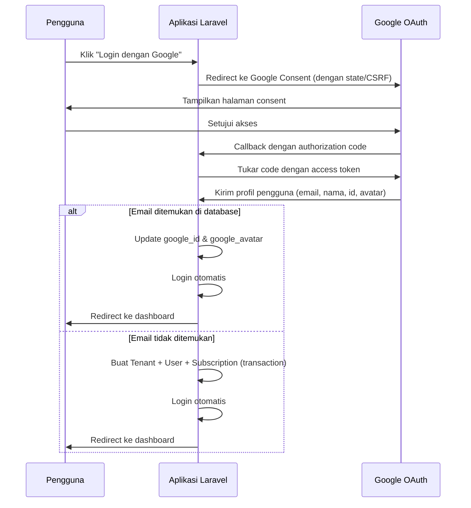
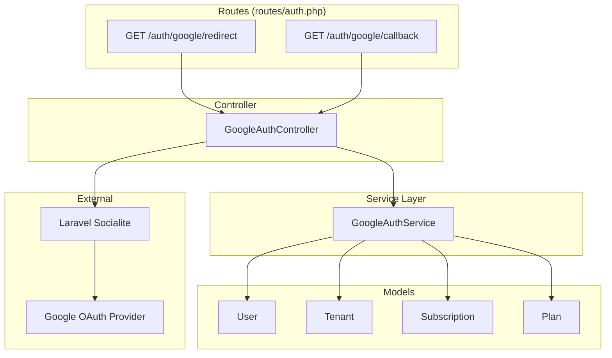

# Dokumen Design — Login Gmail (Google OAuth)

## Overview

Fitur ini mengintegrasikan autentikasi Google OAuth 2.0 ke dalam aplikasi Laravel multi-tenant yang sudah ada menggunakan package **Laravel Socialite**. Fitur ini menyediakan dua alur utama:

1. **Login pengguna terdaftar**: Pengguna yang sudah memiliki akun dapat login via Google, dan sistem akan menghubungkan akun Google mereka secara otomatis.
2. **Registrasi pengguna baru**: Pengguna baru yang login via Google akan otomatis dibuatkan Tenant, User, dan Subscription trial — mengikuti alur yang sama dengan registrasi manual yang sudah ada.

Fitur ini sepenuhnya kompatibel dengan autentikasi email/password (Laravel Breeze) yang sudah berjalan. Pengguna yang mendaftar via Google tidak memerlukan password, sementara pengguna yang sudah memiliki password tetap bisa login dengan cara lama.

### Keputusan Desain Utama

- **Laravel Socialite** dipilih karena merupakan package resmi Laravel untuk OAuth dan sudah menyediakan driver Google built-in.
- Alur registrasi Google menggunakan **pola yang sama** dengan `RegisteredUserController::store()` — membuat Tenant, User, dan Subscription dalam satu database transaction.
- Kolom `password` pada tabel `users` diubah menjadi nullable untuk mendukung pengguna yang mendaftar tanpa password.
- Tombol Google hanya ditampilkan jika environment variables `GOOGLE_CLIENT_ID` dan `GOOGLE_CLIENT_SECRET` sudah dikonfigurasi.

## Architecture

### Diagram Alur OAuth



### Posisi dalam Arsitektur Aplikasi



Controller `GoogleAuthController` bertanggung jawab untuk menangani redirect dan callback OAuth. Logika bisnis pembuatan tenant dan user baru didelegasikan ke `GoogleAuthService` agar tetap konsisten dengan pola service layer yang sudah ada di aplikasi (lihat `app/Services/`).

## Components and Interfaces

### 1. GoogleAuthController

**Path**: `app/Http/Controllers/Auth/GoogleAuthController.php`

Controller ini menangani dua endpoint utama:

```php
class GoogleAuthController extends Controller
{
    public function __construct(
        private GoogleAuthServiceInterface $googleAuthService,
    ) {}

    /**
     * Redirect pengguna ke halaman consent Google.
     */
    public function redirect(): RedirectResponse;

    /**
     * Handle callback dari Google setelah autentikasi.
     */
    public function callback(): RedirectResponse;
}
```

- `redirect()`: Menggunakan `Socialite::driver('google')->scopes(['openid', 'profile', 'email'])->redirect()` untuk mengarahkan pengguna ke Google. Laravel Socialite secara otomatis menangani parameter `state` (CSRF protection).
- `callback()`: Menerima callback dari Google, mengambil data profil pengguna, lalu mendelegasikan ke `GoogleAuthService` untuk menentukan apakah ini login atau registrasi baru.

### 2. GoogleAuthService

**Path**: `app/Services/GoogleAuthService.php`
**Interface**: `app/Services/Contracts/GoogleAuthServiceInterface.php`

```php
interface GoogleAuthServiceInterface
{
    /**
     * Proses autentikasi atau registrasi berdasarkan data profil Google.
     *
     * @param array{id: string, name: string, email: string, avatar: ?string} $googleUser
     * @return User
     */
    public function findOrCreateUser(array $googleUser): User;
}
```

```php
class GoogleAuthService implements GoogleAuthServiceInterface
{
    /**
     * Cari user berdasarkan email. Jika ditemukan, update google_id dan google_avatar.
     * Jika tidak ditemukan, buat Tenant + User + Subscription baru dalam transaction.
     */
    public function findOrCreateUser(array $googleUser): User;

    /**
     * Buat tenant, user, dan subscription trial baru.
     * Mengikuti pola yang sama dengan RegisteredUserController::store().
     */
    private function createTenantWithUser(array $googleUser): User;
}
```

**Keputusan Desain**: Logika pembuatan tenant dipisahkan ke service agar:
- Dapat di-test secara independen tanpa HTTP layer
- Konsisten dengan pola service layer yang sudah ada (`BillingService`, `DeviceService`, dll.)
- Memudahkan reuse jika di masa depan ada provider OAuth lain

### 3. Perubahan pada LoginRequest

**Path**: `app/Http/Requests/Auth/LoginRequest.php`

Method `authenticate()` perlu dimodifikasi untuk mendeteksi pengguna yang mendaftar via Google (password `null`) dan menampilkan pesan error yang sesuai:

```php
public function authenticate(): void
{
    $this->ensureIsNotRateLimited();

    // Cek apakah user terdaftar via Google (tanpa password)
    $user = User::where('email', $this->string('email'))->first();
    if ($user && $user->password === null) {
        throw ValidationException::withMessages([
            'email' => 'Akun ini terdaftar menggunakan Google. Silakan login dengan Google.',
        ]);
    }

    // Proses login normal
    if (! Auth::attempt($this->only('email', 'password'), $this->boolean('remember'))) {
        // ... existing logic
    }
}
```

### 4. Perubahan pada Blade Views

**Login** (`resources/views/auth/login.blade.php`):
- Tambahkan tombol "Login dengan Google" dengan ikon Google SVG
- Separator "Atau" ditempatkan di antara form login dan tombol Google
- Tombol hanya ditampilkan jika `config('services.google.client_id')` terisi

**Register** (`resources/views/auth/register.blade.php`):
- Tambahkan tombol "Daftar dengan Google" dengan ikon Google SVG
- Separator "Atau" ditempatkan di antara form registrasi dan tombol Google
- Tombol hanya ditampilkan jika `config('services.google.client_id')` terisi

### 5. Route Definitions

Ditambahkan di `routes/auth.php` dalam group middleware `guest`:

```php
Route::get('auth/google/redirect', [GoogleAuthController::class, 'redirect'])
    ->name('auth.google.redirect');

Route::get('auth/google/callback', [GoogleAuthController::class, 'callback'])
    ->middleware('throttle:10,1')
    ->name('auth.google.callback');
```

Rate limiting `throttle:10,1` diterapkan pada callback route (maksimal 10 request per menit per IP).

### 6. Konfigurasi

**`config/services.php`** — tambahkan entry Google:

```php
'google' => [
    'client_id' => env('GOOGLE_CLIENT_ID'),
    'client_secret' => env('GOOGLE_CLIENT_SECRET'),
    'redirect' => env('GOOGLE_REDIRECT_URI', '/auth/google/callback'),
],
```

**`.env`** dan **`.env.example`** — tambahkan variabel:

```
GOOGLE_CLIENT_ID=
GOOGLE_CLIENT_SECRET=
GOOGLE_REDIRECT_URI="${APP_URL}/auth/google/callback"
```

## Data Models

### Perubahan pada Tabel `users`

Migration baru untuk menambahkan kolom Google OAuth:

```php
Schema::table('users', function (Blueprint $table) {
    $table->string('google_id')->nullable()->unique()->after('email_verified_at');
    $table->string('google_avatar')->nullable()->after('google_id');
    $table->string('password')->nullable()->change();
});
```

**Kolom baru:**

| Kolom | Tipe | Nullable | Index | Deskripsi |
|-------|------|----------|-------|-----------|
| `google_id` | `string` | Ya | Unique | ID unik pengguna dari Google |
| `google_avatar` | `string` | Ya | - | URL foto profil dari Google |

**Kolom diubah:**

| Kolom | Perubahan | Alasan |
|-------|-----------|--------|
| `password` | `NOT NULL` → `NULL` | Pengguna yang mendaftar via Google tidak memerlukan password |

### Perubahan pada Model User

Tambahkan `google_id` dan `google_avatar` ke atribut fillable:

```php
#[Fillable(['tenant_id', 'name', 'email', 'password', 'role', 'is_active', 'google_id', 'google_avatar'])]
```

### Entity Relationship (Tidak Berubah)

Relasi antar model tetap sama:
- `User` belongsTo `Tenant`
- `Tenant` hasMany `User`
- `Tenant` hasMany `Subscription`
- `Subscription` belongsTo `Plan`

Tidak ada tabel baru yang ditambahkan. Perubahan hanya pada tabel `users` yang sudah ada.


## Correctness Properties

*Correctness property adalah karakteristik atau perilaku yang harus berlaku di semua eksekusi valid dari sebuah sistem — pada dasarnya, pernyataan formal tentang apa yang seharusnya dilakukan sistem. Property berfungsi sebagai jembatan antara spesifikasi yang dapat dibaca manusia dan jaminan kebenaran yang dapat diverifikasi mesin.*

### Property 1: Registrasi pengguna baru via Google menghasilkan setup tenant yang lengkap

*For any* data profil Google yang valid (nama, email, google_id, avatar) di mana email tersebut belum terdaftar di database, memanggil `findOrCreateUser` harus menghasilkan:
- Satu `Tenant` baru dengan `name` dan `email` yang sesuai dengan profil Google
- Satu `User` baru dengan `role` = `admin`, `is_active` = `true`, `google_id` terisi, `password` = `null`, dan `email_verified_at` tidak null
- Satu `Subscription` baru dengan status `active`, terhubung ke Starter Plan, dan durasi sesuai konfigurasi `wa-automation.subscription.trial_duration_days`

**Validates: Requirements 3.1, 3.2, 3.3, 3.4**

### Property 2: Menghubungkan akun Google ke user yang sudah ada memperbarui data Google tanpa mengubah data lainnya

*For any* user yang sudah terdaftar di database (baik dengan password maupun tanpa), ketika `findOrCreateUser` dipanggil dengan profil Google yang memiliki email yang sama, maka:
- `google_id` dan `google_avatar` pada user tersebut harus diperbarui sesuai data dari Google
- `password`, `name`, `role`, `is_active`, `tenant_id`, dan atribut lainnya harus tetap tidak berubah
- Tidak ada `Tenant` atau `Subscription` baru yang dibuat

**Validates: Requirements 2.2, 8.3**

### Property 3: User tanpa password tidak dapat login via form email/password

*For any* user yang memiliki `password` bernilai `null` dan `google_id` terisi, ketika mencoba autentikasi via form email/password, sistem harus menolak login dan mengembalikan pesan error "Akun ini terdaftar menggunakan Google. Silakan login dengan Google."

**Validates: Requirements 8.2**

## Error Handling

### Error pada Redirect ke Google

| Skenario | Penanganan |
|----------|------------|
| Google Provider tidak dapat dijangkau | Tangkap exception dari Socialite, redirect ke halaman login dengan flash message "Tidak dapat terhubung ke layanan Google. Silakan coba lagi." |
| Konfigurasi Google tidak lengkap | Tombol Google disembunyikan dari UI. Jika route diakses langsung, redirect ke login dengan error. |

### Error pada Callback

| Skenario | Penanganan |
|----------|------------|
| Parameter `state` tidak valid (`InvalidStateException`) | Redirect ke halaman login dengan pesan "Sesi autentikasi tidak valid. Silakan coba lagi." |
| Email dari Google tidak valid | Validasi format email, redirect ke login dengan pesan error jika tidak valid. |
| Rate limit terlampaui (>10 req/menit) | Laravel throttle middleware mengembalikan HTTP 429. |
| Race condition pada pembuatan user | Tangkap `QueryException` dengan kode unique violation, fallback ke login user yang sudah ada. |
| Kegagalan database saat transaction | Transaction di-rollback otomatis, redirect ke login dengan pesan error generik. |

### Error pada Login Email/Password

| Skenario | Penanganan |
|----------|------------|
| User Google-only mencoba login via password | Tampilkan pesan "Akun ini terdaftar menggunakan Google. Silakan login dengan Google." |
| User normal login seperti biasa | Tidak ada perubahan pada alur yang sudah ada. |

### Logging

Semua error pada alur OAuth dicatat menggunakan `Log::error()` dengan konteks yang relevan (email, exception message) untuk keperluan debugging. Login sukses via Google dicatat menggunakan `Log::info()`.

## Testing Strategy

### Unit Tests (PHPUnit)

Unit test fokus pada logika bisnis di `GoogleAuthService`:

| Test | Deskripsi |
|------|-----------|
| `testFindOrCreateUserCreatesNewTenantAndUser` | Verifikasi pembuatan Tenant + User + Subscription untuk email baru |
| `testFindOrCreateUserLinksExistingUser` | Verifikasi update google_id/google_avatar untuk user yang sudah ada |
| `testFindOrCreateUserPreservesExistingPassword` | Verifikasi password tidak berubah saat linking |
| `testFindOrCreateUserSetsEmailVerified` | Verifikasi email_verified_at diisi untuk user baru |
| `testFindOrCreateUserHandlesRaceCondition` | Verifikasi fallback ke user yang sudah ada saat race condition |
| `testTransactionRollbackOnFailure` | Verifikasi tidak ada data partial saat transaction gagal |

### Feature Tests (PHPUnit)

Feature test menguji alur HTTP end-to-end dengan Socialite di-mock:

| Test | Deskripsi |
|------|-----------|
| `testGoogleRedirectReturnsCorrectUrl` | Verifikasi redirect ke Google dengan scope yang benar |
| `testGoogleCallbackLoginExistingUser` | Verifikasi login dan redirect ke dashboard untuk user yang sudah ada |
| `testGoogleCallbackRegistersNewUser` | Verifikasi registrasi lengkap untuk user baru |
| `testGoogleCallbackHandlesInvalidState` | Verifikasi penanganan state tidak valid |
| `testGoogleCallbackRateLimited` | Verifikasi rate limiting pada callback route |
| `testGoogleButtonVisibleWhenConfigured` | Verifikasi tombol muncul saat config terisi |
| `testGoogleButtonHiddenWhenNotConfigured` | Verifikasi tombol tersembunyi saat config kosong |
| `testPasswordLoginStillWorksForNormalUsers` | Verifikasi login email/password tetap berfungsi |
| `testPasswordLoginBlockedForGoogleOnlyUsers` | Verifikasi pesan error untuk user Google-only |
| `testSessionRegeneratedAfterGoogleLogin` | Verifikasi session ID berubah setelah login |

### Property-Based Tests (PHPUnit + Custom Generators)

Property-based test memvalidasi correctness properties dengan banyak input acak:

| Property | Min Iterasi | Deskripsi |
|----------|-------------|-----------|
| Property 1: Registrasi lengkap | 100 | Generate profil Google acak, verifikasi Tenant + User + Subscription dibuat dengan benar |
| Property 2: Linking preserves data | 100 | Generate user acak + profil Google acak, verifikasi hanya google_id/google_avatar berubah |
| Property 3: Google-only login blocked | 100 | Generate user tanpa password, verifikasi login via form ditolak |

**Library PBT**: Karena proyek ini menggunakan PHPUnit, property-based test akan diimplementasikan menggunakan loop dengan data yang di-generate oleh factory dan Faker. Setiap test menjalankan minimal 100 iterasi dengan input acak.

**Tag format**: Setiap property test diberi komentar referensi:
```php
// Feature: gmail-login, Property 1: Registrasi pengguna baru via Google menghasilkan setup tenant yang lengkap
```

### Migration Test

| Test | Deskripsi |
|------|-----------|
| `testMigrationAddsGoogleColumns` | Verifikasi kolom google_id dan google_avatar ada setelah migration |
| `testMigrationMakesPasswordNullable` | Verifikasi kolom password menjadi nullable |
| `testGoogleIdHasUniqueIndex` | Verifikasi index unik pada kolom google_id |
