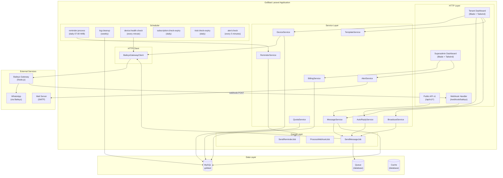
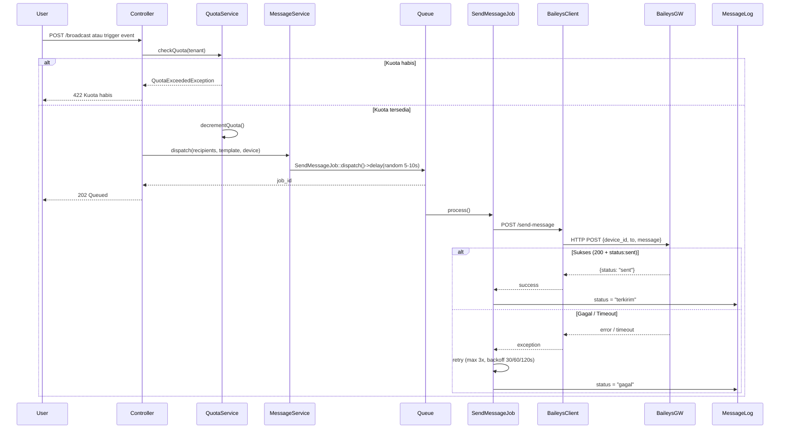
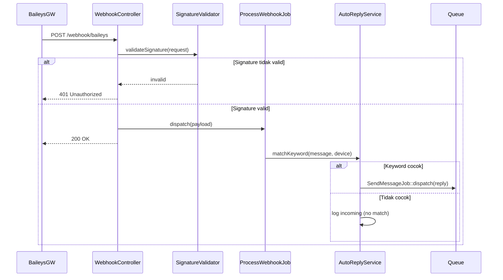
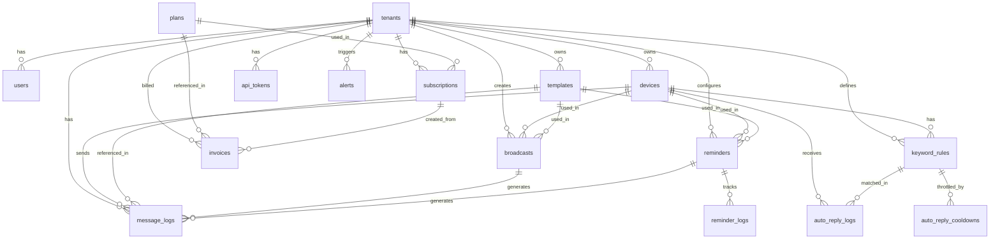

# Dokumen Desain: WA Automation
# Dokumen Desain: WA Automation

## Overview

WA Automation adalah modul SaaS multi-tenant berbasis Laravel 13 yang memungkinkan pengiriman pesan WhatsApp secara otomatis, terjadwal, dan massal. Sistem ini beroperasi sebagai lapisan orkestrasi yang menghubungkan logika bisnis aplikasi dengan layanan gateway Node.js (Baileys) melalui HTTP REST API internal.

Arsitektur sistem dirancang dengan prinsip **tenant isolation** yang ketat, **queue-based delivery** untuk mencegah pemblokiran nomor WhatsApp, dan **subscription-gated features** untuk mendukung model bisnis SaaS berjenjang.

### Komponen Utama

- **Laravel Application (GoBlast)**  Inti sistem, mengelola semua logika bisnis, antrian, penjadwalan, dan antarmuka pengguna
- **Baileys Gateway**  Layanan Node.js eksternal yang menangani koneksi WhatsApp via protokol Baileys; dikomunikasikan melalui HTTP REST API
- **MySQL Database**  Penyimpanan utama untuk semua data tenant, pesan, log, dan konfigurasi
- **Laravel Queue (database driver)**  Antrian asinkron untuk pengiriman pesan bertahap
- **Laravel Scheduler**  Menjalankan reminder harian, pembersihan log, dan pengecekan status koneksi
- **Blade + Tailwind CSS v4**  Frontend untuk Tenant Dashboard dan Superadmin Dashboard

## Architecture

### Diagram Arsitektur Sistem



### Alur Pengiriman Pesan



### Alur Webhook Auto-Reply



## Components and Interfaces

### Service Layer

#### `DeviceService`
Mengelola siklus hidup Device WhatsApp: koneksi, pengecekan status, dan pemutusan koneksi.

```php
interface DeviceServiceInterface
{
    public function requestConnection(Tenant $tenant, string $deviceName): Device;
    public function confirmConnection(string $deviceId, string $sessionData): void;
    public function checkConnectionStatus(Device $device): string;
    public function disconnect(Device $device): void;
    public function canAddDevice(Tenant $tenant): bool;
}
```

#### `MessageService`
Mengorkestrasi pembuatan dan dispatching `SendMessageJob`.

```php
interface MessageServiceInterface
{
    public function sendSingle(Device $device, string $to, string $message, ?Template $template = null): MessageLog;
    public function renderTemplate(Template $template, array $context): string;
    public function dispatchJob(MessageLog $log, int $delaySeconds = 0): void;
}
```

#### `BroadcastService`
Mengelola sesi broadcast massal, validasi CSV, dan dispatching job bertahap.

```php
interface BroadcastServiceInterface
{
    public function createFromCsv(Tenant $tenant, UploadedFile $file, Device $device, Template $template): Broadcast;
    public function createFromRecipients(Tenant $tenant, array $recipients, Device $device, Template $template): Broadcast;
    public function dispatch(Broadcast $broadcast): void;
    public function cancel(Broadcast $broadcast): void;
    public function getProgress(Broadcast $broadcast): BroadcastProgress;
}
```

#### `QuotaService`
Mengelola kuota pesan tenant secara thread-safe.

```php
interface QuotaServiceInterface
{
    public function getRemainingQuota(Tenant $tenant): int;
    public function decrement(Tenant $tenant, int $amount = 1): void;
    public function reset(Tenant $tenant): void;
    public function isExhausted(Tenant $tenant): bool;
    public function isUnlimited(Tenant $tenant): bool;
}
```

#### `BaileysGatewayClient`
HTTP client wrapper untuk komunikasi dengan Baileys Gateway.

```php
interface BaileysGatewayClientInterface
{
    public function sendMessage(string $deviceId, string $to, string $message): BaileysResponse;
    public function getQrCode(string $deviceId): string;
    public function getConnectionStatus(string $deviceId): string;
    public function disconnectDevice(string $deviceId): void;
    public function restartInstance(string $instanceId): void;
}
```

#### `AutoReplyService`
Mencocokkan pesan masuk dengan `KeywordRule` dan mendispatch balasan.

```php
interface AutoReplyServiceInterface
{
    public function processIncomingMessage(string $deviceId, string $from, string $message): void;
    public function matchKeyword(Device $device, string $message): ?KeywordRule;
    public function canReply(string $deviceId, string $from, string $keyword): bool;
}
```

#### `SubscriptionService`
Mengelola status langganan, aktivasi, perpanjangan, dan pengecekan fitur.

```php
interface SubscriptionServiceInterface
{
    public function activate(Tenant $tenant, Plan $plan, int $durationDays, Invoice $invoice): Subscription;
    public function extend(Tenant $tenant, int $additionalDays): void;
    public function isFeatureAllowed(Tenant $tenant, string $feature): bool;
    public function checkExpiry(): void;
}
```

#### `AlertService`
Mengelola pembuatan, pengiriman, dan penanganan alert sistem.

```php
interface AlertServiceInterface
{
    public function create(string $type, string $message, string $severity, ?Tenant $tenant = null): Alert;
    public function resolve(Alert $alert, User $resolvedBy): void;
    public function notifySuperadmin(Alert $alert): void;
}
```

### Value Objects

```php
// Hasil response dari Baileys Gateway
readonly class BaileysResponse
{
    public function __construct(
        public readonly bool $success,
        public readonly string $status,
        public readonly ?string $messageId = null,
        public readonly ?string $errorMessage = null,
    ) {}
}

// Progress broadcast
readonly class BroadcastProgress
{
    public function __construct(
        public readonly int $total,
        public readonly int $sent,
        public readonly int $failed,
        public readonly int $pending,
        public readonly float $percentage,
    ) {}
}
```

## Data Models

### Database Schema

#### Tabel `tenants`
Menyimpan data setiap pelanggan SaaS (tenant).

| Kolom | Tipe | Keterangan |
|---|---|---|
| `id` | `bigint unsigned PK` | Auto-increment |
| `name` | `varchar(255)` | Nama bisnis tenant |
| `email` | `varchar(255) UNIQUE` | Email utama tenant |
| `phone` | `varchar(20) NULL` | Nomor telepon tenant |
| `status` | `enum('active','suspended','trial','expired')` | Status akun |
| `trial_ends_at` | `timestamp NULL` | Tanggal berakhir masa trial |
| `suspended_at` | `timestamp NULL` | Waktu penangguhan |
| `suspended_reason` | `text NULL` | Alasan penangguhan |
| `created_at` | `timestamp` | |
| `updated_at` | `timestamp` | |

**Indexes:** `status`, `trial_ends_at`

---

#### Tabel `users`
Pengguna yang berasosiasi dengan tenant (atau superadmin).

| Kolom | Tipe | Keterangan |
|---|---|---|
| `id` | `bigint unsigned PK` | |
| `tenant_id` | `bigint unsigned NULL FK` | NULL = superadmin |
| `name` | `varchar(255)` | |
| `email` | `varchar(255) UNIQUE` | |
| `password` | `varchar(255)` | Bcrypt hash |
| `role` | `enum('superadmin','admin','member')` | Peran pengguna |
| `is_active` | `boolean DEFAULT true` | Status aktif |
| `email_verified_at` | `timestamp NULL` | |
| `remember_token` | `varchar(100) NULL` | |
| `created_at` | `timestamp` | |
| `updated_at` | `timestamp` | |

**Indexes:** `tenant_id`, `role`, `is_active`
**Foreign Keys:** `tenant_id  tenants.id ON DELETE SET NULL`

---

#### Tabel `plans`
Paket langganan yang tersedia.

| Kolom | Tipe | Keterangan |
|---|---|---|
| `id` | `bigint unsigned PK` | |
| `name` | `varchar(100)` | Nama paket (Starter, Pro, Business) |
| `slug` | `varchar(100) UNIQUE` | starter, pro, business, pay-per-message |
| `price` | `decimal(12,2)` | Harga per periode |
| `message_quota` | `int NULL` | NULL = tidak terbatas |
| `max_devices` | `int DEFAULT 1` | Maks device aktif |
| `has_reminder` | `boolean DEFAULT false` | Akses fitur Reminder |
| `has_api` | `boolean DEFAULT false` | Akses API publik |
| `has_multi_device` | `boolean DEFAULT false` | Akses multi-device |
| `description` | `text NULL` | Deskripsi paket |
| `is_active` | `boolean DEFAULT true` | Tampil di halaman langganan |
| `sort_order` | `int DEFAULT 0` | Urutan tampil |
| `created_at` | `timestamp` | |
| `updated_at` | `timestamp` | |

---

#### Tabel `subscriptions`
Langganan aktif setiap tenant.

| Kolom | Tipe | Keterangan |
|---|---|---|
| `id` | `bigint unsigned PK` | |
| `tenant_id` | `bigint unsigned FK` | |
| `plan_id` | `bigint unsigned FK` | |
| `status` | `enum('active','expired','cancelled')` | |
| `message_quota_used` | `int DEFAULT 0` | Pesan terpakai periode ini |
| `message_quota_limit` | `int NULL` | Snapshot kuota saat aktivasi; NULL = unlimited |
| `starts_at` | `timestamp` | Awal periode |
| `ends_at` | `timestamp` | Akhir periode |
| `created_at` | `timestamp` | |
| `updated_at` | `timestamp` | |

**Indexes:** `tenant_id`, `status`, `ends_at`
**Foreign Keys:** `tenant_id  tenants.id ON DELETE CASCADE`, `plan_id  plans.id`

---

#### Tabel `invoices`
Catatan pembayaran manual oleh Superadmin.

| Kolom | Tipe | Keterangan |
|---|---|---|
| `id` | `bigint unsigned PK` | |
| `tenant_id` | `bigint unsigned FK` | |
| `plan_id` | `bigint unsigned FK` | |
| `subscription_id` | `bigint unsigned NULL FK` | Diisi setelah aktivasi |
| `recorded_by` | `bigint unsigned FK` | User (superadmin) yang mencatat |
| `amount` | `decimal(12,2)` | Nominal pembayaran |
| `duration_days` | `int` | Durasi langganan (hari) |
| `paid_at` | `date` | Tanggal pembayaran |
| `notes` | `text NULL` | Catatan tambahan |
| `created_at` | `timestamp` | |
| `updated_at` | `timestamp` | |

**Indexes:** `tenant_id`, `paid_at`
**Foreign Keys:** `tenant_id  tenants.id`, `plan_id  plans.id`, `recorded_by  users.id`

---

#### Tabel `devices`
Nomor WhatsApp yang terhubung ke Baileys Gateway.

| Kolom | Tipe | Keterangan |
|---|---|---|
| `id` | `bigint unsigned PK` | |
| `tenant_id` | `bigint unsigned FK` | |
| `name` | `varchar(255)` | Label device (misal: "CS Utama") |
| `phone_number` | `varchar(20) NULL` | Nomor WA setelah terhubung |
| `gateway_device_id` | `varchar(100) UNIQUE` | ID device di Baileys Gateway |
| `status` | `enum('pending','connected','disconnected','error')` | |
| `last_seen_at` | `timestamp NULL` | Terakhir kali health check sukses |
| `session_data` | `text NULL` | Data sesi terenkripsi dari Baileys |
| `created_at` | `timestamp` | |
| `updated_at` | `timestamp` | |

**Indexes:** `tenant_id`, `status`, `gateway_device_id`
**Foreign Keys:** `tenant_id  tenants.id ON DELETE CASCADE`

---

#### Tabel `templates`
Template pesan dengan variabel dinamis.

| Kolom | Tipe | Keterangan |
|---|---|---|
| `id` | `bigint unsigned PK` | |
| `tenant_id` | `bigint unsigned FK` | |
| `name` | `varchar(255)` | Nama template |
| `type` | `enum('notification','promo','reminder')` | Kategori template |
| `content` | `text` | Isi template (max 4096 karakter) |
| `variables` | `json NULL` | Daftar variabel yang digunakan |
| `created_at` | `timestamp` | |
| `updated_at` | `timestamp` | |

**Indexes:** `tenant_id`, `type`
**Foreign Keys:** `tenant_id  tenants.id ON DELETE CASCADE`

---

#### Tabel `broadcasts`
Sesi pengiriman pesan massal.

| Kolom | Tipe | Keterangan |
|---|---|---|
| `id` | `bigint unsigned PK` | |
| `tenant_id` | `bigint unsigned FK` | |
| `device_id` | `bigint unsigned FK` | |
| `template_id` | `bigint unsigned NULL FK` | |
| `name` | `varchar(255)` | Label broadcast |
| `status` | `enum('draft','queued','running','completed','cancelled','failed')` | |
| `total_recipients` | `int DEFAULT 0` | |
| `sent_count` | `int DEFAULT 0` | |
| `failed_count` | `int DEFAULT 0` | |
| `pending_count` | `int DEFAULT 0` | |
| `source_type` | `enum('csv','database')` | Sumber daftar nomor |
| `csv_path` | `varchar(500) NULL` | Path file CSV di storage |
| `scheduled_at` | `timestamp NULL` | Waktu terjadwal (NULL = segera) |
| `started_at` | `timestamp NULL` | |
| `completed_at` | `timestamp NULL` | |
| `created_at` | `timestamp` | |
| `updated_at` | `timestamp` | |

**Indexes:** `tenant_id`, `status`, `device_id`
**Foreign Keys:** `tenant_id  tenants.id`, `device_id  devices.id`, `template_id  templates.id ON DELETE SET NULL`

---

#### Tabel `message_logs`
Log setiap upaya pengiriman pesan.

| Kolom | Tipe | Keterangan |
|---|---|---|
| `id` | `bigint unsigned PK` | |
| `tenant_id` | `bigint unsigned FK` | |
| `device_id` | `bigint unsigned NULL FK` | |
| `broadcast_id` | `bigint unsigned NULL FK` | |
| `reminder_id` | `bigint unsigned NULL FK` | |
| `template_id` | `bigint unsigned NULL FK` | |
| `job_id` | `varchar(100) NULL` | UUID job di queue |
| `recipient` | `varchar(20)` | Nomor tujuan |
| `message` | `text` | Isi pesan yang dikirim |
| `status` | `enum('pending','sent','failed','cancelled','retrying')` | |
| `source` | `enum('broadcast','trigger','reminder','api','auto_reply')` | Asal pengiriman |
| `error_message` | `text NULL` | Pesan error jika gagal |
| `attempts` | `tinyint DEFAULT 0` | Jumlah percobaan |
| `sent_at` | `timestamp NULL` | Waktu berhasil terkirim |
| `failed_at` | `timestamp NULL` | Waktu gagal permanen |
| `created_at` | `timestamp` | |
| `updated_at` | `timestamp` | |

**Indexes:** `tenant_id`, `status`, `device_id`, `broadcast_id`, `recipient`, `created_at`, `job_id`
**Foreign Keys:** `tenant_id  tenants.id`, `device_id  devices.id ON DELETE SET NULL`, `broadcast_id  broadcasts.id ON DELETE SET NULL`

---

#### Tabel `reminders`
Konfigurasi reminder otomatis terjadwal.

| Kolom | Tipe | Keterangan |
|---|---|---|
| `id` | `bigint unsigned PK` | |
| `tenant_id` | `bigint unsigned FK` | |
| `device_id` | `bigint unsigned FK` | |
| `template_id` | `bigint unsigned FK` | |
| `name` | `varchar(255)` | Label reminder |
| `type` | `enum('spp_due','invoice_unpaid','booking_tomorrow')` | Jenis kondisi |
| `is_active` | `boolean DEFAULT true` | |
| `last_run_at` | `timestamp NULL` | Terakhir dieksekusi scheduler |
| `created_at` | `timestamp` | |
| `updated_at` | `timestamp` | |

**Indexes:** `tenant_id`, `is_active`, `type`
**Foreign Keys:** `tenant_id  tenants.id ON DELETE CASCADE`, `device_id  devices.id`, `template_id  templates.id`

---

#### Tabel `reminder_logs`
Mencegah duplikasi pengiriman reminder dalam 24 jam.

| Kolom | Tipe | Keterangan |
|---|---|---|
| `id` | `bigint unsigned PK` | |
| `reminder_id` | `bigint unsigned FK` | |
| `recipient` | `varchar(20)` | Nomor tujuan |
| `condition_key` | `varchar(255)` | Kunci kondisi unik (misal: invoice_id) |
| `sent_at` | `timestamp` | |

**Indexes:** `reminder_id`, `(reminder_id, recipient, condition_key, sent_at)`  composite untuk cek duplikasi
**Foreign Keys:** `reminder_id  reminders.id ON DELETE CASCADE`

---

#### Tabel `keyword_rules`
Aturan auto-reply berbasis kata kunci.

| Kolom | Tipe | Keterangan |
|---|---|---|
| `id` | `bigint unsigned PK` | |
| `tenant_id` | `bigint unsigned FK` | |
| `device_id` | `bigint unsigned FK` | |
| `keyword` | `varchar(255)` | Kata kunci pemicu (case-insensitive) |
| `reply` | `text` | Balasan otomatis |
| `priority` | `int DEFAULT 0` | Urutan prioritas (lebih tinggi = lebih diprioritaskan) |
| `is_active` | `boolean DEFAULT true` | |
| `created_at` | `timestamp` | |
| `updated_at` | `timestamp` | |

**Indexes:** `tenant_id`, `device_id`, `is_active`
**Unique:** `(device_id, keyword)`  satu keyword per device
**Foreign Keys:** `tenant_id  tenants.id ON DELETE CASCADE`, `device_id  devices.id ON DELETE CASCADE`

---

#### Tabel `auto_reply_logs`
Log pesan masuk dan status pencocokan keyword.

| Kolom | Tipe | Keterangan |
|---|---|---|
| `id` | `bigint unsigned PK` | |
| `tenant_id` | `bigint unsigned FK` | |
| `device_id` | `bigint unsigned FK` | |
| `keyword_rule_id` | `bigint unsigned NULL FK` | NULL jika tidak ada yang cocok |
| `from` | `varchar(20)` | Nomor pengirim |
| `message` | `text` | Isi pesan masuk |
| `matched` | `boolean DEFAULT false` | |
| `reply_sent` | `boolean DEFAULT false` | |
| `received_at` | `timestamp` | |
| `created_at` | `timestamp` | |

**Indexes:** `tenant_id`, `device_id`, `from`, `received_at`

---

#### Tabel `auto_reply_cooldowns`
Mencegah loop balasan (1 balasan per nomor per keyword per 60 menit).

| Kolom | Tipe | Keterangan |
|---|---|---|
| `id` | `bigint unsigned PK` | |
| `device_id` | `bigint unsigned FK` | |
| `keyword_rule_id` | `bigint unsigned FK` | |
| `from` | `varchar(20)` | Nomor pengirim |
| `expires_at` | `timestamp` | Waktu cooldown berakhir |
| `created_at` | `timestamp` | |

**Indexes:** `(device_id, keyword_rule_id, from, expires_at)`  composite untuk cek cooldown

---

#### Tabel `api_tokens`
Token autentikasi untuk API publik.

| Kolom | Tipe | Keterangan |
|---|---|---|
| `id` | `bigint unsigned PK` | |
| `tenant_id` | `bigint unsigned FK` | |
| `name` | `varchar(255)` | Label token |
| `token_hash` | `varchar(64) UNIQUE` | SHA-256 hash dari token |
| `last_used_at` | `timestamp NULL` | |
| `revoked_at` | `timestamp NULL` | NULL = aktif |
| `created_at` | `timestamp` | |
| `updated_at` | `timestamp` | |

**Indexes:** `tenant_id`, `token_hash`, `revoked_at`
**Foreign Keys:** `tenant_id  tenants.id ON DELETE CASCADE`

---

#### Tabel `system_logs`
Log sistem global (lintas tenant).

| Kolom | Tipe | Keterangan |
|---|---|---|
| `id` | `bigint unsigned PK` | |
| `tenant_id` | `bigint unsigned NULL FK` | NULL = log sistem global |
| `user_id` | `bigint unsigned NULL FK` | Pengguna yang memicu log |
| `type` | `varchar(100)` | Jenis log (device.connected, quota.exhausted, dll.) |
| `severity` | `enum('info','warning','error','critical')` | |
| `message` | `text` | |
| `context` | `json NULL` | Data konteks tambahan |
| `created_at` | `timestamp` | |

**Indexes:** `tenant_id`, `severity`, `type`, `created_at`
**Foreign Keys:** `tenant_id  tenants.id ON DELETE SET NULL`

---

#### Tabel `alerts`
Alert sistem untuk Superadmin.

| Kolom | Tipe | Keterangan |
|---|---|---|
| `id` | `bigint unsigned PK` | |
| `tenant_id` | `bigint unsigned NULL FK` | |
| `type` | `varchar(100)` | gateway.down, quota.90pct, jobs.failed_spike |
| `severity` | `enum('warning','error','critical')` | |
| `message` | `text` | |
| `context` | `json NULL` | |
| `status` | `enum('active','resolved')` | |
| `resolved_by` | `bigint unsigned NULL FK` | |
| `resolved_at` | `timestamp NULL` | |
| `created_at` | `timestamp` | |
| `updated_at` | `timestamp` | |

**Indexes:** `status`, `type`, `tenant_id`, `created_at`

---

#### Tabel `gateway_instances`
Daftar instance Baileys Gateway yang dikelola Superadmin.

| Kolom | Tipe | Keterangan |
|---|---|---|
| `id` | `bigint unsigned PK` | |
| `name` | `varchar(255)` | Label instance |
| `base_url` | `varchar(500)` | URL base instance |
| `status` | `enum('active','inactive','error')` | |
| `last_error` | `text NULL` | Pesan error terakhir |
| `last_checked_at` | `timestamp NULL` | |
| `created_at` | `timestamp` | |
| `updated_at` | `timestamp` | |

---

#### Tabel `system_configs`
Konfigurasi global platform yang dapat diubah Superadmin.

| Kolom | Tipe | Keterangan |
|---|---|---|
| `id` | `bigint unsigned PK` | |
| `key` | `varchar(100) UNIQUE` | Kunci konfigurasi |
| `value` | `text` | Nilai konfigurasi |
| `type` | `enum('integer','string','boolean','json')` | Tipe data |
| `description` | `text NULL` | |
| `updated_by` | `bigint unsigned NULL FK` | |
| `created_at` | `timestamp` | |
| `updated_at` | `timestamp` | |

**Konfigurasi default:**
- `default_rate_limit_per_hour` = `200`
- `default_delay_min_seconds` = `5`
- `default_delay_max_seconds` = `10`
- `trial_duration_days` = `14`
- `log_retention_days` = `90`
- `system_log_retention_days` = `180`

---

### Entity Relationship Diagram




## API Endpoints

### Public API v1 (untuk Tenant dengan paket Business)

#### Send Single Message
```
POST /api/v1/send-message
Authorization: Bearer {api_token}
Content-Type: application/json

{
  "device_id": "uuid",
  "to": "6281234567890",
  "message": "Halo, ini pesan test",
  "template_id": "uuid" (optional)
}

Response 202 Accepted:
{
  "success": true,
  "job_id": "uuid",
  "status": "queued",
  "message": "Pesan telah dimasukkan ke antrian"
}

Response 401 Unauthorized:
{
  "error": "Unauthorized",
  "message": "Token tidak valid atau tidak ditemukan"
}

Response 422 Unprocessable Entity:
{
  "error": "Validation failed",
  "errors": {
    "to": ["Format nomor telepon tidak valid"],
    "device_id": ["Device tidak ditemukan"]
  }
}
```

#### Send Bulk Messages
```
POST /api/v1/send-bulk
Authorization: Bearer {api_token}
Content-Type: application/json

{
  "device_id": "uuid",
  "recipients": ["6281234567890", "6281234567891"],
  "message": "Halo, ini pesan bulk",
  "template_id": "uuid" (optional)
}

Response 202 Accepted:
{
  "success": true,
  "broadcast_id": "uuid",
  "total_recipients": 2,
  "status": "queued",
  "message": "Broadcast telah dimasukkan ke antrian"
}
```

#### Check Message Status
```
GET /api/v1/message-status/{job_id}
Authorization: Bearer {api_token}

Response 200 OK:
{
  "job_id": "uuid",
  "status": "sent",
  "recipient": "6281234567890",
  "sent_at": "2026-04-26T10:30:00Z",
  "message": "Pesan berhasil terkirim"
}

Response 404 Not Found:
{
  "error": "Not found",
  "message": "Job tidak ditemukan"
}
```

### Webhook Endpoints

#### Baileys Incoming Message Webhook
```
POST /webhook/baileys
Content-Type: application/json
X-Baileys-Signature: {hmac_sha256}

{
  "event": "message.received",
  "device_id": "uuid",
  "from": "6281234567890",
  "message": "harga",
  "timestamp": 1704067200000
}

Response 200 OK:
{
  "success": true,
  "message": "Webhook processed"
}

Response 401 Unauthorized:
{
  "error": "Invalid signature"
}
```

---

## Queue Jobs

### SendMessageJob
Mengirim satu pesan ke Baileys Gateway dengan retry logic.

```php
class SendMessageJob implements ShouldQueue
{
    use Dispatchable, InteractsWithQueue, Queueable, SerializesModels;

    public int $tries = 3;
    public int $backoff = [30, 60, 120]; // detik
    public int $timeout = 30;

    public function __construct(
        public MessageLog $messageLog,
    ) {}

    public function handle(BaileysGatewayClient $client): void
    {
        // Validasi kuota sebelum mengirim
        if ($this->messageLog->tenant->subscription->isExpired()) {
            $this->messageLog->update(['status' => 'cancelled']);
            return;
        }

        try {
            $response = $client->sendMessage(
                $this->messageLog->device->gateway_device_id,
                $this->messageLog->recipient,
                $this->messageLog->message
            );

            if ($response->success && $response->status === 'sent') {
                $this->messageLog->update([
                    'status' => 'sent',
                    'sent_at' => now(),
                    'attempts' => $this->attempts(),
                ]);
            } else {
                throw new Exception($response->errorMessage ?? 'Unknown error');
            }
        } catch (Exception $e) {
            $this->messageLog->update([
                'error_message' => $e->getMessage(),
                'attempts' => $this->attempts(),
            ]);

            if ($this->attempts() >= $this->tries) {
                $this->messageLog->update(['status' => 'failed', 'failed_at' => now()]);
                AlertService::create('job.failed_permanent', "Pesan ke {$this->messageLog->recipient} gagal permanen");
            } else {
                $this->messageLog->update(['status' => 'retrying']);
                throw $e;
            }
        }
    }

    public function failed(Throwable $exception): void
    {
        $this->messageLog->update([
            'status' => 'failed',
            'failed_at' => now(),
            'error_message' => $exception->getMessage(),
        ]);
    }
}
```

### ProcessWebhookJob
Memproses webhook pesan masuk dari Baileys Gateway.

```php
class ProcessWebhookJob implements ShouldQueue
{
    use Dispatchable, InteractsWithQueue, Queueable;

    public function __construct(
        public array $payload,
    ) {}

    public function handle(AutoReplyService $autoReplyService): void
    {
        $autoReplyService->processIncomingMessage(
            $this->payload['device_id'],
            $this->payload['from'],
            $this->payload['message']
        );
    }
}
```

### SendReminderJob
Mengirim reminder berdasarkan kondisi data.

```php
class SendReminderJob implements ShouldQueue
{
    use Dispatchable, InteractsWithQueue, Queueable;

    public function __construct(
        public Reminder $reminder,
    ) {}

    public function handle(ReminderService $reminderService): void
    {
        $reminderService->execute($this->reminder);
    }
}
```

---

## Scheduled Commands

### reminder:process
Dijalankan setiap hari pukul 07:00 WIB untuk memproses reminder otomatis.

```php
class ProcessRemindersCommand extends Command
{
    protected $signature = 'reminder:process';
    protected $description = 'Process scheduled reminders';

    public function handle(ReminderService $service): int
    {
        $reminders = Reminder::where('is_active', true)->get();
        $processed = 0;

        foreach ($reminders as $reminder) {
            SendReminderJob::dispatch($reminder);
            $processed++;
        }

        Log::info("Processed {$processed} reminders");
        return Command::SUCCESS;
    }
}
```

### log:cleanup
Dijalankan setiap minggu untuk menghapus log yang sudah lebih dari 90 hari.

```php
class CleanupLogsCommand extends Command
{
    protected $signature = 'log:cleanup';
    protected $description = 'Clean up old message logs';

    public function handle(): int
    {
        $retentionDays = config('wa-automation.log_retention_days', 90);
        $cutoffDate = now()->subDays($retentionDays);

        MessageLog::where('created_at', '<', $cutoffDate)->delete();
        SystemLog::where('created_at', '<', $cutoffDate)->delete();

        Log::info("Cleaned up logs older than {$cutoffDate}");
        return Command::SUCCESS;
    }
}
```

### device:health-check
Dijalankan setiap menit untuk memantau status koneksi device.

```php
class DeviceHealthCheckCommand extends Command
{
    protected $signature = 'device:health-check';
    protected $description = 'Check device connection status';

    public function handle(DeviceService $service): int
    {
        $devices = Device::where('status', 'connected')->get();

        foreach ($devices as $device) {
            try {
                $status = $service->checkConnectionStatus($device);
                if ($status !== 'connected') {
                    $device->update(['status' => 'disconnected']);
                    AlertService::create(
                        'device.disconnected',
                        "Device {$device->name} terputus",
                        'warning',
                        $device->tenant
                    );
                }
            } catch (Exception $e) {
                $device->update(['status' => 'error']);
            }
        }

        return Command::SUCCESS;
    }
}
```

### subscription:check-expiry
Dijalankan setiap hari untuk mengirim notifikasi berakhirnya langganan.

```php
class CheckSubscriptionExpiryCommand extends Command
{
    protected $signature = 'subscription:check-expiry';
    protected $description = 'Check subscription expiry and send notifications';

    public function handle(SubscriptionService $service): int
    {
        // Notifikasi H-7
        $sevenDaysLater = now()->addDays(7);
        Subscription::where('ends_at', '<=', $sevenDaysLater)
            ->where('ends_at', '>', now())
            ->where('notified_7_days', false)
            ->each(function ($sub) {
                Mail::send(new SubscriptionExpiringNotification($sub, 7));
                $sub->update(['notified_7_days' => true]);
            });

        // Notifikasi H-3
        $threeDaysLater = now()->addDays(3);
        Subscription::where('ends_at', '<=', $threeDaysLater)
            ->where('ends_at', '>', now())
            ->where('notified_3_days', false)
            ->each(function ($sub) {
                Mail::send(new SubscriptionExpiringNotification($sub, 3));
                $sub->update(['notified_3_days' => true]);
            });

        // Deaktifkan langganan yang sudah expired
        Subscription::where('ends_at', '<=', now())
            ->where('status', 'active')
            ->update(['status' => 'expired']);

        return Command::SUCCESS;
    }
}
```

### trial:check-expiry
Dijalankan setiap hari untuk mengirim notifikasi berakhirnya trial.

```php
class CheckTrialExpiryCommand extends Command
{
    protected $signature = 'trial:check-expiry';
    protected $description = 'Check trial expiry and send notifications';

    public function handle(): int
    {
        // Notifikasi H-3
        $threeDaysLater = now()->addDays(3);
        Tenant::where('trial_ends_at', '<=', $threeDaysLater)
            ->where('trial_ends_at', '>', now())
            ->where('status', 'trial')
            ->where('notified_trial_3_days', false)
            ->each(function ($tenant) {
                Mail::send(new TrialExpiringNotification($tenant, 3));
                $tenant->update(['notified_trial_3_days' => true]);
            });

        // Notifikasi H-1
        $oneDayLater = now()->addDay();
        Tenant::where('trial_ends_at', '<=', $oneDayLater)
            ->where('trial_ends_at', '>', now())
            ->where('status', 'trial')
            ->where('notified_trial_1_day', false)
            ->each(function ($tenant) {
                Mail::send(new TrialExpiringNotification($tenant, 1));
                $tenant->update(['notified_trial_1_day' => true]);
            });

        // Deaktifkan trial yang sudah expired
        Tenant::where('trial_ends_at', '<=', now())
            ->where('status', 'trial')
            ->update(['status' => 'expired']);

        return Command::SUCCESS;
    }
}
```

### alert:check
Dijalankan setiap 5 menit untuk memantau kondisi sistem dan membuat alert.

```php
class CheckAlertsCommand extends Command
{
    protected $signature = 'alert:check';
    protected $description = 'Check system health and create alerts';

    public function handle(AlertService $alertService): int
    {
        // Cek gateway status
        GatewayInstance::each(function ($instance) use ($alertService) {
            $lastCheck = $instance->last_checked_at;
            if (!$lastCheck || $lastCheck->diffInMinutes(now()) > 5) {
                try {
                    $response = Http::timeout(10)->get("{$instance->base_url}/health");
                    if ($response->successful()) {
                        $instance->update(['status' => 'active', 'last_error' => null]);
                    }
                } catch (Exception $e) {
                    $instance->update(['status' => 'error', 'last_error' => $e->getMessage()]);
                    $alertService->create('gateway.down', "Gateway {$instance->name} tidak merespons", 'critical');
                }
                $instance->update(['last_checked_at' => now()]);
            }
        });

        // Cek failed jobs spike
        $failedJobsLastHour = MessageLog::where('status', 'failed')
            ->where('failed_at', '>=', now()->subHour())
            ->count();

        if ($failedJobsLastHour > 50) {
            $alertService->create(
                'jobs.failed_spike',
                "Spike: {$failedJobsLastHour} pesan gagal dalam 1 jam terakhir",
                'error'
            );
        }

        return Command::SUCCESS;
    }
}
```

---

## Authentication & Authorization

### Role-Based Access Control (RBAC)

**Roles:**
- `superadmin` — Akses penuh ke seluruh platform, Superadmin Dashboard
- `admin` — Mengelola tenant mereka sendiri, akses Tenant Dashboard
- `member` — Pengguna biasa dalam tenant, akses fitur terbatas

**Middleware:**
```php
// app/Http/Middleware/EnsureSuperadmin.php
class EnsureSuperadmin
{
    public function handle(Request $request, Closure $next)
    {
        if (auth()->user()?->role !== 'superadmin') {
            abort(403, 'Unauthorized');
        }
        return $next($request);
    }
}

// app/Http/Middleware/EnsureTenantAccess.php
class EnsureTenantAccess
{
    public function handle(Request $request, Closure $next)
    {
        $tenantId = $request->route('tenant_id');
        if (auth()->user()->tenant_id !== $tenantId && auth()->user()->role !== 'superadmin') {
            abort(403, 'Unauthorized');
        }
        return $next($request);
    }
}
```

### API Token Authentication

```php
// app/Http/Middleware/AuthenticateApiToken.php
class AuthenticateApiToken
{
    public function handle(Request $request, Closure $next)
    {
        $token = $request->bearerToken();
        if (!$token) {
            return response()->json(['error' => 'Unauthorized'], 401);
        }

        $tokenHash = hash('sha256', $token);
        $apiToken = ApiToken::where('token_hash', $tokenHash)
            ->where('revoked_at', null)
            ->first();

        if (!$apiToken) {
            return response()->json(['error' => 'Unauthorized'], 401);
        }

        $request->setUserResolver(fn() => $apiToken->tenant);
        $apiToken->update(['last_used_at' => now()]);

        return $next($request);
    }
}
```

---

## Error Handling & Logging

### Exception Handling

```php
// app/Exceptions/Handler.php
class Handler extends ExceptionHandler
{
    public function register(): void
    {
        $this->reportable(function (QuotaExceededException $e) {
            Log::warning("Quota exceeded for tenant {$e->tenant->id}");
        });

        $this->reportable(function (BaileysGatewayException $e) {
            Log::error("Baileys Gateway error: {$e->getMessage()}");
            AlertService::create('gateway.error', $e->getMessage(), 'error');
        });

        $this->reportable(function (SubscriptionExpiredException $e) {
            Log::info("Subscription expired for tenant {$e->tenant->id}");
        });
    }

    public function render($request, Throwable $exception)
    {
        if ($exception instanceof QuotaExceededException) {
            return response()->json(['error' => 'Quota exceeded'], 422);
        }

        if ($exception instanceof BaileysGatewayException) {
            return response()->json(['error' => 'Gateway error'], 503);
        }

        return parent::render($request, $exception);
    }
}
```

### Logging Strategy

- **Application Logs** → `storage/logs/laravel.log` (rotasi harian)
- **Message Logs** → Database `message_logs` table (retention 90 hari)
- **System Logs** → Database `system_logs` table (retention 180 hari)
- **Queue Logs** → Database `failed_jobs` table (untuk debugging)

---

## Security Considerations

### Input Validation & Sanitization

```php
// Validasi nomor telepon
$validated = $request->validate([
    'to' => 'required|regex:/^62\d{9,12}$/',
    'message' => 'required|string|max:4096',
]);

// Sanitasi template variables
$message = preg_replace_callback('/\{(\w+)\}/', function ($matches) use ($context) {
    return htmlspecialchars($context[$matches[1]] ?? '', ENT_QUOTES, 'UTF-8');
}, $template->content);
```

### Rate Limiting

```php
// Per API token: 60 requests per minute
Route::middleware('throttle:60,1')->group(function () {
    Route::post('/api/v1/send-message', [MessageController::class, 'sendSingle']);
    Route::post('/api/v1/send-bulk', [MessageController::class, 'sendBulk']);
});

// Per device: 200 messages per hour (enforced in SendMessageJob)
```

### Webhook Signature Validation

```php
// Validasi signature webhook dari Baileys Gateway
$signature = $request->header('X-Baileys-Signature');
$payload = $request->getContent();
$secret = config('wa-automation.baileys_webhook_secret');

$expectedSignature = hash_hmac('sha256', $payload, $secret);
if (!hash_equals($expectedSignature, $signature)) {
    abort(401, 'Invalid signature');
}
```

### Data Encryption

```php
// Enkripsi session data device sebelum disimpan
$encrypted = Crypt::encryptString($sessionData);
$device->update(['session_data' => $encrypted]);

// Dekripsi saat digunakan
$decrypted = Crypt::decryptString($device->session_data);
```

---

## Performance Optimization

### Database Indexing Strategy

- **Composite indexes** untuk query yang sering digunakan:
  - `(tenant_id, status, created_at)` pada `message_logs`
  - `(device_id, keyword_rule_id, from, expires_at)` pada `auto_reply_cooldowns`
  - `(reminder_id, recipient, condition_key, sent_at)` pada `reminder_logs`

### Query Optimization

```php
// Eager loading untuk menghindari N+1
$broadcasts = Broadcast::with(['device', 'template', 'tenant'])
    ->where('tenant_id', $tenantId)
    ->paginate(15);

// Chunking untuk operasi bulk
MessageLog::where('created_at', '<', $cutoffDate)
    ->chunk(1000, function ($logs) {
        $logs->each->delete();
    });
```

### Caching Strategy

```php
// Cache konfigurasi sistem
$config = Cache::remember('system_config', 3600, function () {
    return SystemConfig::pluck('value', 'key')->toArray();
});

// Cache daftar paket aktif
$plans = Cache::remember('active_plans', 3600, function () {
    return Plan::where('is_active', true)->get();
});

// Invalidate cache saat ada perubahan
Cache::forget('system_config');
Cache::forget('active_plans');
```

---

## Deployment & Configuration

### Environment Variables

```env
# Baileys Gateway
BAILEYS_GATEWAY_URL=http://localhost:3000
BAILEYS_WEBHOOK_SECRET=your_secret_key

# Queue
QUEUE_CONNECTION=database
QUEUE_DRIVER=database

# Mail
MAIL_MAILER=smtp
MAIL_HOST=smtp.mailtrap.io
MAIL_PORT=2525
MAIL_USERNAME=your_username
MAIL_PASSWORD=your_password
MAIL_FROM_ADDRESS=noreply@goblast.test

# WA Automation
WA_AUTOMATION_TRIAL_DAYS=14
WA_AUTOMATION_LOG_RETENTION_DAYS=90
WA_AUTOMATION_SYSTEM_LOG_RETENTION_DAYS=180
WA_AUTOMATION_RATE_LIMIT_PER_HOUR=200
WA_AUTOMATION_DELAY_MIN_SECONDS=5
WA_AUTOMATION_DELAY_MAX_SECONDS=10
WA_AUTOMATION_CONTACT_WA=wa.me/6281529211963
```

### Service Configuration

```php
// config/wa-automation.php
return [
    'baileys' => [
        'gateway_url' => env('BAILEYS_GATEWAY_URL'),
        'webhook_secret' => env('BAILEYS_WEBHOOK_SECRET'),
        'timeout' => 30,
    ],
    'queue' => [
        'rate_limit_per_hour' => env('WA_AUTOMATION_RATE_LIMIT_PER_HOUR', 200),
        'delay_min_seconds' => env('WA_AUTOMATION_DELAY_MIN_SECONDS', 5),
        'delay_max_seconds' => env('WA_AUTOMATION_DELAY_MAX_SECONDS', 10),
        'max_retries' => 3,
    ],
    'trial' => [
        'duration_days' => env('WA_AUTOMATION_TRIAL_DAYS', 14),
    ],
    'retention' => [
        'message_logs_days' => env('WA_AUTOMATION_LOG_RETENTION_DAYS', 90),
        'system_logs_days' => env('WA_AUTOMATION_SYSTEM_LOG_RETENTION_DAYS', 180),
    ],
    'contact' => [
        'whatsapp' => env('WA_AUTOMATION_CONTACT_WA', 'wa.me/6281529211963'),
    ],
];
```

---

## Testing Strategy

### Unit Tests
- Service layer logic (QuotaService, TemplateService, etc.)
- Value objects dan helpers
- Validation rules

### Feature Tests
- API endpoints (send-message, send-bulk, message-status)
- Webhook processing
- Queue job execution
- Scheduler commands

### Integration Tests
- End-to-end message flow (trigger → queue → Baileys → log)
- Subscription lifecycle (trial → active → expired)
- Multi-tenant isolation

### Property-Based Tests (PBT)
- Template variable rendering dengan berbagai input
- Quota calculation dengan concurrent requests
- Rate limiting enforcement

---

## Correctness Properties

Sistem harus memenuhi properti-properti berikut:

1. **Tenant Isolation**: Data satu tenant tidak pernah terlihat oleh tenant lain
2. **Quota Enforcement**: Pesan yang dikirim tidak pernah melebihi kuota tenant
3. **Message Delivery Guarantee**: Setiap pesan dicoba minimal 3 kali sebelum gagal permanen
4. **Rate Limiting**: Tidak lebih dari 200 pesan per device per jam
5. **Subscription Gating**: Fitur hanya dapat diakses sesuai paket langganan
6. **Webhook Idempotency**: Webhook yang sama tidak memproses balasan duplikat dalam 60 menit
7. **Log Retention**: Log otomatis dihapus setelah periode retention
8. **Alert Deduplication**: Alert yang sama tidak dibuat lebih dari sekali dalam periode tertentu

